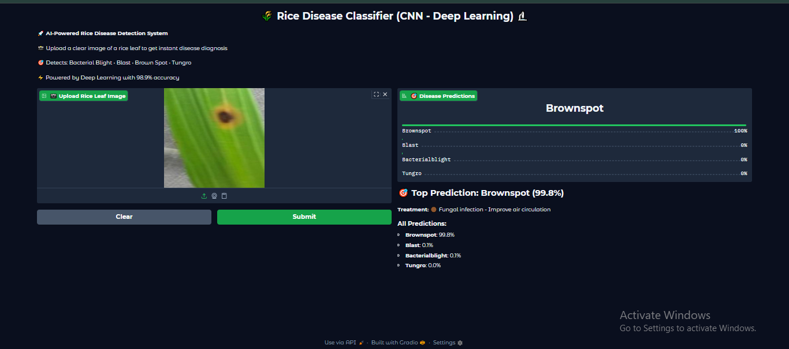

# 🌾 Rice Leaf Disease Classifier

[](https://www.python.org/)
[](https://tensorflow.org/)
[](https://gradio.app/)

> **CNN-based Rice Leaf Disease Classifier with 98.9% accuracy. Detects Bacterial Blight, Blast, Brown Spot, and Tungro in rice leaves.**

## 🎯 Problem Statement

Rice is one of the world's most important staple crops, feeding over half the global population. However, rice cultivation faces significant challenges from various diseases that can cause substantial yield losses:

- **Economic Impact**: Rice diseases cause billions of dollars in crop losses annually
- **Food Security**: Disease outbreaks threaten food security for millions of people
- **Late Detection**: Traditional disease identification requires expert knowledge and is often too late
- **Limited Access**: Rural farmers lack access to agricultural experts for timely diagnosis
- **Manual Inspection**: Current methods are time-consuming, subjective, and error-prone

## 💡 Problem Solving

This project addresses these challenges through **AI-powered precision agriculture**:

### 🔬 **Our Solution**
- **Instant Diagnosis**: Upload a leaf image and get results in seconds
- **High Accuracy**: 98.9% accuracy using deep Convolutional Neural Networks
- **Accessible Technology**: Simple web interface accessible via any device
- **Early Detection**: Enables farmers to take preventive action before widespread damage

### 🎯 **Target Diseases**
1. **Bacterial Blight** - Bacterial infection causing yield reduction
2. **Blast** - Fungal disease, most destructive rice disease worldwide  
3. **Brown Spot** - Fungal infection affecting grain quality
4. **Tungro** - Viral disease transmitted by leafhoppers

## 🚀 Live Demo

**🌐 Try it now:** [Rice Disease Classifier - Live Demo](https://your-gradio-link-here.com)

*Experience the power of AI-driven agriculture technology!*

## 📸 App Preview



*Clean, intuitive interface designed for farmers and agricultural professionals*

## ⚡ Features

- 🔍 **Instant Disease Detection** - Get results in under 15 seconds
- 🎯 **98.9% Accuracy** - Trained on thousands of rice leaf images
- 📱 **Mobile Friendly** - Works on any device with internet connection
- 🌐 **Web Interface** - No installation required, just upload and analyze
- 💊 **Treatment Guidance** - Specific recommendations for each disease
- 📊 **Confidence Scores** - See prediction confidence for all diseases
- 🌾 **Farmer Focused** - Designed with agricultural professionals in mind

## 🛠️ Technical Architecture

### **Model Architecture**
```
Input Layer (224×224×3) 
    ↓
Rescaling Layer (Normalize 0-1)
    ↓
Conv2D (32) → MaxPool2D
    ↓
Conv2D (64) → MaxPool2D  
    ↓
Conv2D (128) → MaxPool2D
    ↓
Flatten → Dense(128) → Dropout(0.5)
    ↓
Output Layer (4 classes, Softmax)
```

### **Training Details**
- **Train/Validation Split**: 80/20 with stratified sampling
- **Early Stopping**: Prevents overfitting, restores best weights
- **Optimizer**: Adam with learning rate scheduling
- **Loss Function**: Sparse Categorical Crossentropy

## 📁 Project Structure

```
rice-disease-classifier/
│
├── app.py                                 # Gradio web interface
├── requirements.txt                       # Python dependencies  
├── rice_disease_model.keras              # Trained CNN model
├── rice_disease_cnn_classifier.ipynb     # Training notebook
├── README.md                             # Project documentation
└── image/
    └── preview.png                       # App screenshot
```

## 🚀 Quick Start

### **1. Clone Repository**
```bash
git clone https://github.com/adeel-iqbal/rice-disease-classifier-cnn.git
cd rice-disease-classifier-cnn
```

### **2. Install Dependencies**
```bash
pip install -r requirements.txt
```

### **3. Run Application**
```bash
python app.py
```

### **4. Open in Browser**
Navigate to `http://localhost:7860` and start classifying rice diseases!

## 📋 Requirements

```
tensorflow>=2.10.0
gradio>=3.50.0
pillow>=9.0.0
numpy>=1.21.0
```

## 📊 Model Performance

| Metric | Score |
|--------|-------|
| **Overall Accuracy** | 98.9% |
| **Bacterial Blight** | Precision: 99%, Recall: 99% |
| **Blast** | Precision: 99%, Recall: 98% |
| **Brown Spot** | Precision: 99%, Recall: 100% |
| **Tungro** | Precision: 98%, Recall: 99% |
| **Training Time** | 12 epochs (Early stopping at epoch 9) |
| **Model Size** | 42.61 MB |

## 🌱 Usage

1. **Launch the application** using `python app.py`
2. **Upload a clear image** of a rice leaf showing symptoms
3. **Get instant results** with confidence scores for all diseases
4. **Read treatment recommendations** for the identified disease
5. **Take appropriate action** to protect your crop

## 🔬 Technology Stack

- **Deep Learning**: TensorFlow 2.x, Keras, Convolutional Neural Networks (CNN)
- **Web Interface**: Gradio 
- **Image Processing**: PIL (Pillow)
- **Data Science**: NumPy, Pandas
- **Development**: Python 3.8+

## 🤝 Contributing

Contributions are welcome! Here's how you can help:

1. 🍴 **Fork** the repository
2. 🔧 **Create** a feature branch (`git checkout -b feature/AmazingFeature`)
3. 💻 **Commit** your changes (`git commit -m 'Add AmazingFeature'`)
4. 📤 **Push** to the branch (`git push origin feature/AmazingFeature`)
5. 🔃 **Open** a Pull Request

## 👨‍💻 Author

**Adeel Iqbal Memon**

- 📧 **Email**: [adeelmemon096@yahoo.com](mailto:adeelmemon096@yahoo.com)
- 💼 **LinkedIn**: [linkedin.com/in/adeeliqbalmemon](https://linkedin.com/in/adeeliqbalmemon)
- 🐙 **GitHub**: [@adeel-iqbal](https://github.com/adeel-iqbal)

---

<div align="center">

### 🌾 **Empowering Farmers with AI Technology** 🚀

**If this project helped you, please consider giving it a ⭐!**

*Built with ❤️ for sustainable agriculture and food security*

</div>

## 📞 Support

Having issues? Need help?

- 🐛 **Bug Reports**: [Open an issue](https://github.com/adeel-iqbal/rice-disease-classifier-cnn/issues)
- 💡 **Feature Requests**: [Request a feature](https://github.com/adeel-iqbal/rice-disease-classifier-cnn/issues)
- 📧 **Direct Contact**: [adeelmemon096@yahoo.com](mailto:adeelmemon096@yahoo.com)

*Let's build the future of smart agriculture together!* 🌱
